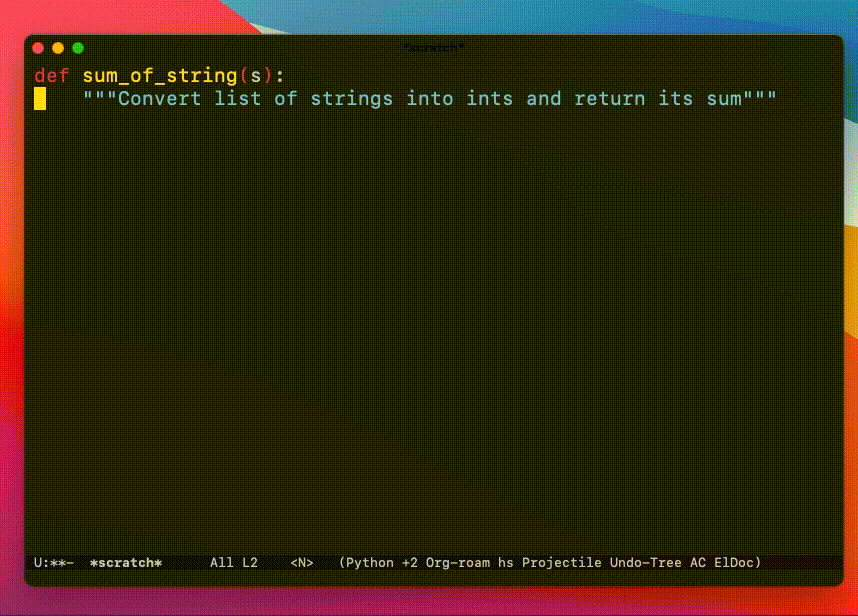

## AI Assistant for Emacs


An open-source, imitation of [GitHub Copilot](https://copilot.github.com/) using [Replit Code 3B](https://huggingface.co/replit/replit-code-v1-3b) or [EleutherAI GPT-Neo-2.7B](https://huggingface.co/EleutherAI/gpt-neo-2.7B) (via Huggingface Model Hub) for Emacs.



# Setup
## Inference End / Backend


1. Set ```bash =device= ``` to ```bash "cpu" ``` or ``` bash "cuda" ``` in ```bash =serve/server.py= ```

2. The "priming" is currently done in Python. If you want, modify it to another language or turn it off (from subjective experience, priming seems to help).

3. Launch ```bash =serve/server.py= ``` This will launch a Flask app which will allow us to sample the model via REST API.

## Emacs
1. In ```bash =emacs/secondmate.el= ```, customize the URL in ```bash =secondmate-url= ```to the address the API is running on.
